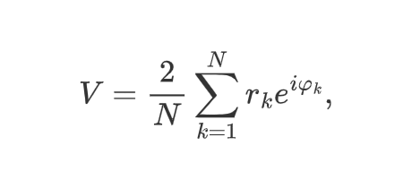
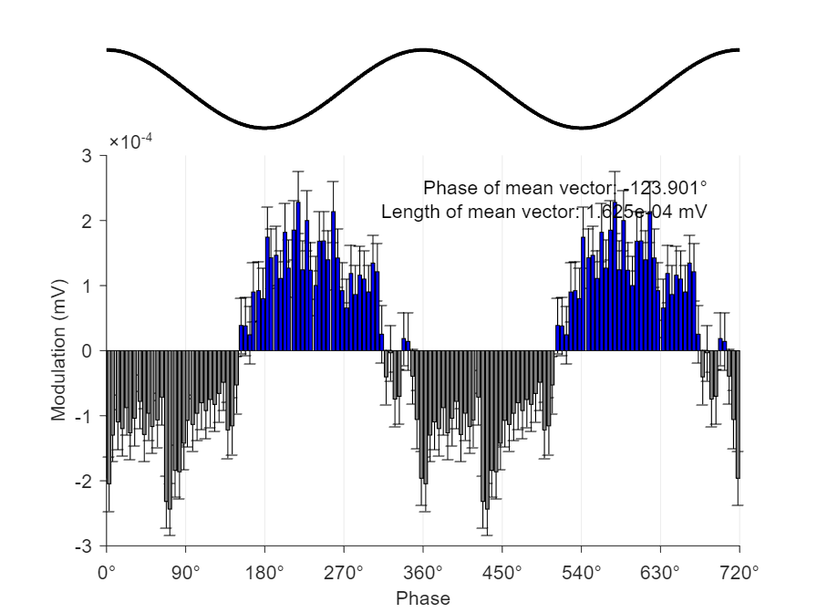
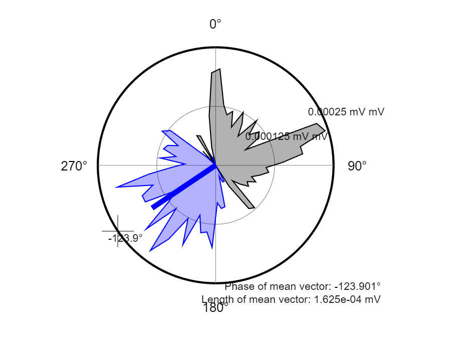
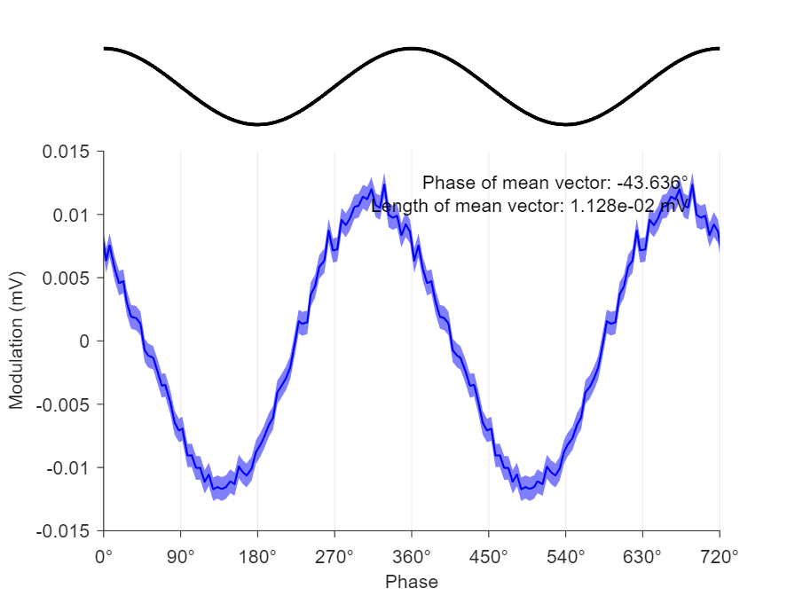
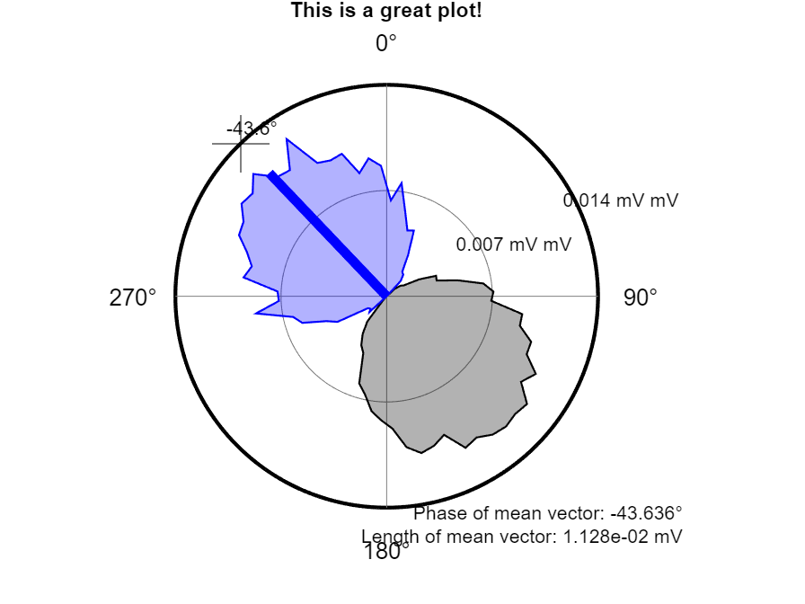
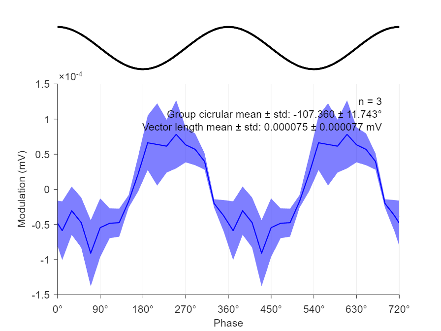
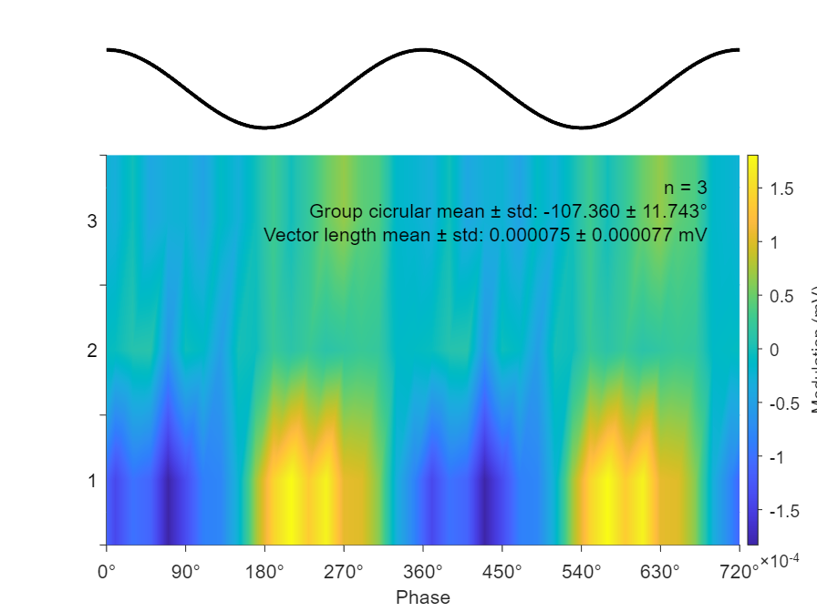
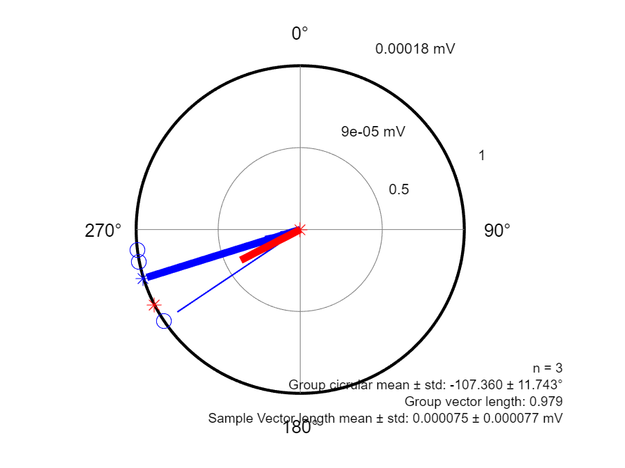

# phase-averaged-waveform
MATLAB code for the phase-analysis of continuous data, including EEG and background unit activity (BUA).


`K_PhaseWave`, `K_plotCircPhaseHist_one` was used to create the **phase-averaged waveform** plots in **Figures 7–9** of [Nakamura et al., (2021)](https://doi.org/10.1523/JNEUROSCI.1753-21.2021) for the phase analysis of continuous BUA data. 


# Requirements

The following additional MATLAB programs are required.

- [**CircStat for MATLAB**](https://github.com/circstat/circstat-matlab) by Philipp Berens
    - Specifically the following four functions are required
        - `circ_confmean.m`
        - `circ_mean.m`
        - `circ_r.m`
        - `circ_std.m`
- [**Red Blue Colormap**](https://uk.mathworks.com/matlabcentral/fileexchange/25536-red-blue-colormap) by Adam Auton
    - `redblue.m`


# Definition of phase-averaged waveforms

**Phase-averaged waveform** is the average of continuous signal, eg. ECoG, LFP, and background unit activity (BUA), in voltage (μV) in each bin (eg. size = 5°) of the instantaneous phase values of the band-pass filtered reference signal, eg.  ECoG band-pass filtered at 15–30 Hz (zero-phase shift Butterworth filter with the order of 3). A sample vector for an individual continuous signal is defined in the complex plane as the double of an average of complex number-based vector representations of the instantaneous phase values and the values of the continuous signal of each data point, i.e. 



where 𝜑<sub>*k*</sub> and   *r<sub>k</sub>* represent the instantaneous phase in radians and the value of the continuous signal (signed) in μV for the *k*th data point, respectively, *N* is the number of data points, and *i* is the imaginary unit. The average was doubled to reflect the amplitude difference between the positive and negative deflections. If the phase-averaged waveform of a signal is an ideal sinusoidal curve, the sample vector length |*V*| is identical to the peak-to-peak amplitude in μV.


# Usage

The MATLAB Live Script `K_PhaseWave_demo.mlx` provides example usage of `K_PhaseWave` (the main function), and accompanying plotting finctions `K_plotLinearPhaseWave`, `K_plotCircPhaseWave_one`, and `K_plotCircPhaseWave_group`.

### Prepare Butterworth bandpass filter
```matlab
% Prepare Butterworth bandpass filter for beta frequency (13-30 Hz) for 1024 Hz data

Wn = normalizedfreq([13 30],1024); % get normalized frequency
[b, a] = butter(3, Wn,'bandpass'); % create bandpass filter

fvtool(b,a,'Fs',newRate); % for visualization
xlim([0 5]);ylim('auto');

assert(isstable(b,a)); % check if the filter is stable
```

### One data

`bua1L.Data` and `eeg1L.Data` are continuous data of BUA and ECoG, both sampled at 1024 Hz.

```matlab
results = K_PhaseWave(bua1L.Data,eeg1L.Data,1024,1024, b, a,...
    'randomization','none',...
    'histtype','bar',...
    'histbin',72,... % Bin size for the histogram
    'plotLinear',true,...
    'plotCirc',true);
```





```matlab
% one signal in a linear plot
hlin = K_plotLinearPhaseWave(results,'ErrorBar','sem');
```



```matlab
% one signal in a circular plot
hcirc = K_plotCircPhaseWave_one(results,'Title','This is a great plot!');
```




### Group data

Analyse three data and show the analysis of group data.

```matlab
results(1) = K_PhaseWave(bua1L.Data,eeg1L.Data,1024,1024,b,a,...
    'randomization','none','HistBin',18);

results(2) = K_PhaseWave(bua2L.Data,eeg2L.Data,1024,1024,b,a,...
    'randomization','none','HistBin',18);

results(3) = K_PhaseWave(bua3L.Data,eeg3L.Data,1024,1024,b,a,...
    'randomization','none','HistBin',18)

% Linear plot
K_plotLinearPhaseWave(results)
```



```matlab
% Surface plot
K_plotLinearPhaseWave(results,'PlotType','surface')
```



```matlab
% Circular plot
K_plotCircPhaseWave_group(results)

```



### Syntax

```matlab
[results, handles] = K_PhaseWave(lfpwaveform,eegwaveform,...
    sourceRate,newRate,b,a)
[results, handles] = K_PhaseWave(____,'Parameter', value, ...)
```


#### Input arguments

| Input arguments | Description                                                  |
| --------------- | ------------------------------------------------------------ |
| `lfpwaveform`   | vector of source data from LFP (EEG, BUA) channel            |
| `eegwaveform`   | vector of source data from the reference EEG channel (`lfpwaveform` &  `eegwaveform`: must have same length) |
| `sourceRate`    | sampling rate [Hz] of the input data event and EEG           |
| `newRate`       | the new sampling rate [Hz] after resample. In many cases, 1024 is good. |
| `b`, `a`        | `b` and `a` as coefficients of a filter transfer function. `b`, `a` must be calculated for `newRate` rather than `souceRate`. |

 You can obtain`b` and `a` by:

```matlab
[b, a] = butter(n, Wn)
```

where `n` is the order of the Butterworth filter (lowpass), or half the order(bandpass). `Wn` is normalized cuttoff frequency, i.e. [cycles per sec] divided by Niquist frequency [newRate/2].

```matlab
Wn = frequencyHz/(samplingrateHz/2)
```

The following command can check the stablity of the filter:

```matlab
fvtool(b,a,'FrequencyScale','log', 'Analysis','info');
```

#### Optional Parameter/Value Pairs

| Parameters        | Values                                  |
| ----------------- | --------------------------------------- |
| `'PlotLinear'`    | true \| false (default)                 |
| `'PlotCirc'`      | true \| false (default)                 |
| `'Histbin'`       | number of histogram bins (default = 72) |
| `'HistType'`      | 'line' (default) \| 'bar'               |
| `'Randomization'` | 'none' \| 'bootstrap' \| 'circshift'    |

The `'Randomization'`  parameter sets the shuffling method to compute *p* values. 

`'bootstrap'` uses `bootstrap` function to shuffle both the continuous signal and the instantaneous phase values if the reference signal 1000 times. This method does not maintain the shape of waveforms at all.

`'circshift'` uses `circshift` function and repeat random circular shifting of the data within cycles of given oscillation, eg. beta. This method maintains the shape of the waveform while randomly shifting the instantaneous phase values. I consider this is a preferred method for shuffling.


# References

- Nakamura KC, Sharott A, Tanaka T, Magill PJ (2021) Input zone-selective dysrhythmia in motor thalamus after dopamine depletion. *J Neurosci*, ***in press***, https://doi.org/10.1523/JNEUROSCI.1753-21.2021
- Berens P (2009) CircStat: A MATLAB toolbox for circular statistics. *J Stat Softw* 31:1–21, http://www.jstatsoft.org/v31/i10


# Contacts

Dr Kouichi C. Nakamura

MRC Brain Network Dynamics Unit, University of Oxford

kouichi.c.nakamura@gmail.com

kouichi.nakamura@ndcn.ox.ac.uk


